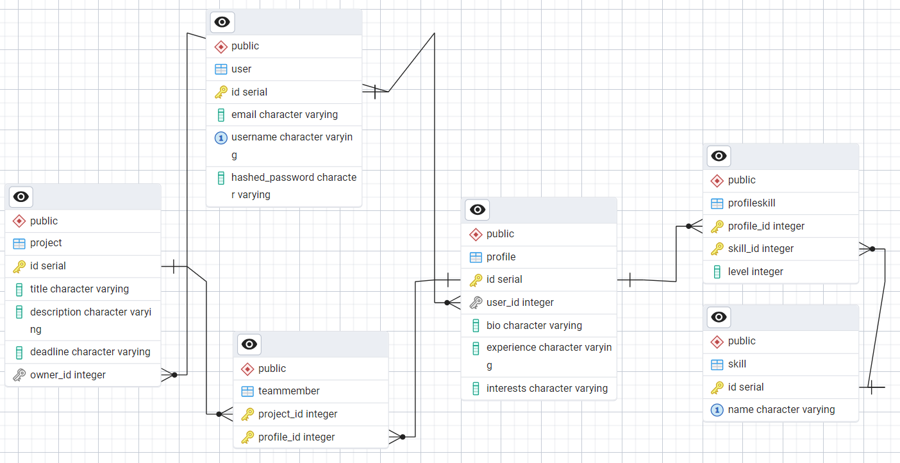

# Лабораторная работа №1 — FastAPI сервис

## Описание проекта

Разработано серверное приложение на основе FastAPI, предоставляющее функционал для поиска людей в команду.  
Пользователи могут:
  - Создавать профили с описанием опыта, навыков и интересов
  - Указывать свои навыки с уровнем владения
  - Создавать проекты с описанием целей и сроков
  - Добавлять участников в проекты с указанием их ролей
  - Искать других пользователей по опыту и навыкам

---

## Архитектура проекта

### Технологии:
- **FastAPI** — для реализации REST API
- **SQLModel** — ORM, связь с PostgreSQL
- **PostgreSQL** — реляционная база данных
- **Alembic** — система миграций
- **Pydantic** — типизация входящих/исходящих данных
- **Swagger UI** — документация и тестирование

---

## Модели данных



### 1. `User`
- `id`: уникальный идентификатор
- `email`: email пользователя
- `username`: имя пользователя
- `hashed_password`: захэшированный пароль

### 2. `Profile`
- `id`: уникальный идентификатор
- `user_id`: ссылка на `User`
- `bio`: краткое описание
- `experience`: опыт работы
- `interests`: интересы
- `skills`: список навыков (many-to-many через `ProfileSkill`)

### 3. `Skill`
- `id`: уникальный идентификатор
- `name`: название навыка (например, "Python", "FastAPI")

### 4. `ProfileSkill`
- `profile_id`: ссылка на `Profile`
- `skill_id`: ссылка на `Skill`
- `level`: уровень владения (от 1 до 5)

### 5. `Project`
- `id`: уникальный идентификатор
- `title`: название проекта
- `description`: описание целей и требований
- `deadline`: дата завершения
- `owner_id`: ссылка на `User`

### 6. `TeamMember` *(many-to-many между `Profile` и `Project`)*
- `profile_id`: ссылка на `Profile`
- `project_id`: ссылка на `Project`
- `role`: роль пользователя в проекте (например, "Backend Developer")
- `joined_at`: дата присоединения

---

## Функционал API

### Эндпоинты:

| Метод | Эндпоинт             | Описание |
|-------|----------------------|----------|
| POST  | `/users/`            | Создание пользователя |
| POST  | `/profiles/`         | Создание профиля |
| GET   | `/profiles/`         | Список профилей (с фильтрацией) |
| GET   | `/profiles/{id}`     | Информация о профиле |
| POST  | `/projects/`         | Создание проекта |
| POST  | `/team-members/`     | Добавление участника в проект |
| GET   | `/projects/{id}`     | Информация о проекте и его участниках |

---

## Примеры запросов

### 🔹 Создание пользователя

```http
POST /users/
{
  "email": "test@example.com",
  "username": "testuser",
  "password": "secret"
}
```

### 🔹 Создание профиля

```http
POST /profiles/
{
  "user_id": 1,
  "bio": "Python разработчик",
  "experience": "3 года",
  "interests": "FastAPI, SQL",
  "skills": [
    {"skill_id": 1, "level": 5},
    {"skill_id": 2, "level": 4}
  ]
}
```

### 🔹 Поиск профиля по навыкам

```http
GET /profiles/?skill=python
```
→ Возвращает всех с навыком Python

### 🔹 Добавление участника в проект

```http
POST /team-members/
{
  "profile_id": 1,
  "project_id": 1,
  "role": "Backend Developer"
}
```

### 🔹 Получение информации о проекте

```http
GET /projects/1
```
→ Возвращает проект со списком участников и их ролями