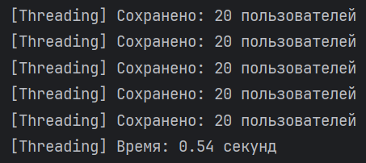
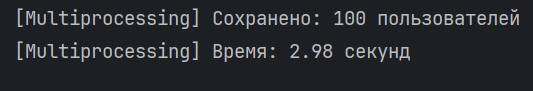
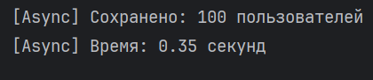

# Лабораторная работа №2 - Потоки. Процессы. Асинхронность.

## Задача 2. Параллельный парсинг веб-страниц с сохранением в базу данных

Задача: Напишите программу на Python для параллельного парсинга нескольких веб-страниц с сохранением данных в базу данных с использованием подходов threading, multiprocessing и async. Каждая программа должна парсить информацию с нескольких веб-сайтов, сохранять их в базу данных.

Будем парсить 100 случайных пользователей по API
"https://  randomuser.me/api/?results="

## Threading
```
import requests
from threading import Thread
from config import SITE_URL, CHUNKS, CHUNK_SIZE
from database import User, get_session

def fetch_and_save():
    response = requests.get(f"{SITE_URL}{CHUNK_SIZE}")
    data = response.json()["results"]

    users = [{
        "email": item["email"],
        "username": item["login"]["username"]
    } for item in data]

    with get_session() as session:
        existing_emails = {u.email for u in session.query(User).all()}
        new_users = [User(**u) for u in users if u["email"] not in existing_emails]
        session.add_all(new_users)
        session.commit()
        print(f"[Threading] Сохранено: {len(new_users)} пользователей")

def run_threads():
    threads = [Thread(target=fetch_and_save) for _ in range(CHUNKS)]
    start = time.time()

    for t in threads:
        t.start()
    for t in threads:
        t.join()

    end = time.time()
    print(f"[Threading] Время: {end - start:.2f} секунд")
```
Результаты



## Multiprocess
```
import requests
from config import SITE_URL, CHUNKS, CHUNK_SIZE
from database import User, get_session


def fetch_users(_):
    response = requests.get(f"{SITE_URL}{CHUNK_SIZE}")
    return response.json()["results"]


def save_chunk(data_list):
    with get_session() as session:
        for item in data_list:
            user = {
                "email": item["email"],
                "username": item["login"]["username"]
            }
            db_user = User(**user)
            existing = session.query(User).filter(User.email == db_user.email).first()
            if not existing:
                session.add(db_user)
        session.commit()


def run_multiprocessing():
    with multiprocessing.Pool(2) as pool:
        all_results = pool.map(fetch_users, range(CHUNKS))

    flat_results = [item for sublist in all_results for item in sublist]

    with get_session() as session:
        existing_emails = {u.email for u in session.query(User).all()}
        new_users = [u for u in flat_results if u["email"] not in existing_emails]

        with multiprocessing.Pool(2) as pool:
            pool.map(save_chunk, [new_users[i::2] for i in range(2)])

    print(f"[Multiprocessing] Сохранено: {len(new_users)} пользователей")
```
Результаты



## Async
```
import asyncio
import aiohttp
from config import SITE_URL, CHUNKS, CHUNK_SIZE
from database import User, get_session

async def fetch(session, url):
    async with session.get(url) as response:
        return await response.json()

def extract_users(data):
    return [{
        "email": item["email"],
        "username": item["login"]["username"]
    } for item in data["results"] if isinstance(item, dict)]

async def main():
    urls = [f"{SITE_URL}{CHUNK_SIZE}" for _ in range(CHUNKS)]

    async with aiohttp.ClientSession() as http_session:
        tasks = [fetch(http_session, url) for url in urls]
        results = await asyncio.gather(*tasks)

    all_users = []
    for data in results:
        all_users.extend(extract_users(data))

    with get_session() as session:
        existing_emails = {u.email for u in session.query(User).all()}
        new_users = [User(**u) for u in all_users if u["email"] not in existing_emails]

        session.add_all(new_users)
        session.commit()
        print(f"[Async] Сохранено: {len(new_users)} пользователей")
```
Результаты



Результаты парсинга (100 пользователей)

| Метод        | Время | Описание |
|--------------|-------|----------|
| Threading    | 0.54  | Эффективно при небольшом количестве задач I/O. Простая реализация, низкие накладные расходы. |
| Multiprocess | 2.98  | Неэффективен для I/O-задач, накладные расходы делают multiprocessing избыточным в этой задаче. |
| Async        | 0.35  | Быстрее других благодаря отсутствию лишнего создания потоков/процессов. |