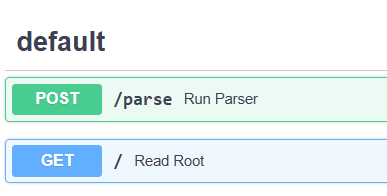
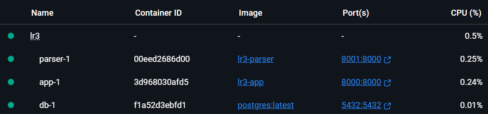
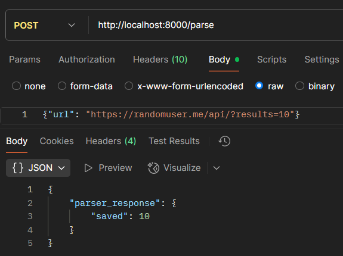
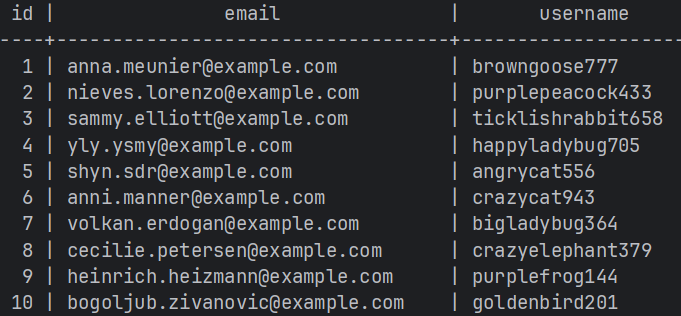

# Лабораторная работа 3: Упаковка FastAPI приложения в Docker, Работа с источниками данных и Очереди

## Цель:
Научиться упаковывать FastAPI приложение в Docker, интегрировать парсер данных с базой данных и вызывать парсер через API и очередь.

## Вызов парсера по http



## Dockerfile

Необходимо создать Dockerfile для упаковки FastAPI приложения и приложения с паресером. В Dockerfile указать базовый образ, установить необходимые зависимости, скопировать исходные файлы в контейнер и определить команду для запуска приложения.
Dockerfile сервиса
```
# team_finder/Dockerfile

FROM python:3.12-slim

WORKDIR /app

# Копируем зависимости
COPY requirements.txt .
RUN pip install --no-cache-dir -r requirements.txt

# Копируем содержимое app/
COPY app/ /app/app/

EXPOSE 8000

CMD ["uvicorn", "app.main:app", "--host", "0.0.0.0", "--port", "8000"]
```

Dockerfile парсера
```
# Dockerfile

FROM python:3.12-slim

WORKDIR /parser

# Установка зависимостей
COPY requirements.txt .
RUN pip install --no-cache-dir -r requirements.txt

# Копируем код
COPY main.py .

EXPOSE 8000

# Запуск сервера
CMD ["uvicorn", "main:app", "--host", "0.0.0.0", "--port", "8000"]
```
## Docker Compose
Необходимо написать docker-compose.yml для управления оркестром сервисов, включающих FastAPI приложение, базу данных и парсер данных. Определите сервисы, укажите порты и зависимости между сервисами.
Код из файла:
```
version: '3.9'

services:
  app:
    build: ./team_finder
    ports:
      - "8000:8000"
    depends_on:
      - db
    networks:
      - app-network

  parser:
    build: ./parser_app
    ports:
      - "8001:8000"
    depends_on:
      - db
    networks:
      - app-network

  db:
    image: postgres:latest
    environment:
      POSTGRES_USER: postgres
      POSTGRES_PASSWORD: postgres
      POSTGRES_DB: team_finder
    ports:
      - "5432:5432"
    networks:
      - app-network

networks:
  app-network:
    driver: bridge
```
## Вызов парсера из FastAPI
Необходимо добавить в FastAPI приложение ендпоинт, который будет принимать запросы с URL для парсинга от клиента, отправлять запрос парсеру (запущенному в отдельном контейнере) и возвращать ответ с результатом клиенту.
```
@router.post("/parse")
def run_parser(req: ParseRequest):
    try:
        parser_url = "http://parser:8000/parse"
        response = requests.post(parser_url, json={"url": req.url})

        if response.status_code != 200:
            raise HTTPException(status_code=500, detail="Ошибка при вызове парсера")

        return {"parser_response": response.json()}

    except Exception as e:
        raise HTTPException(status_code=500, detail=f"Не удалось связаться с парсером: {str(e)}")
```

## Запуск
Поднимем контейнеры



Отправим запрос и проверим записи.




